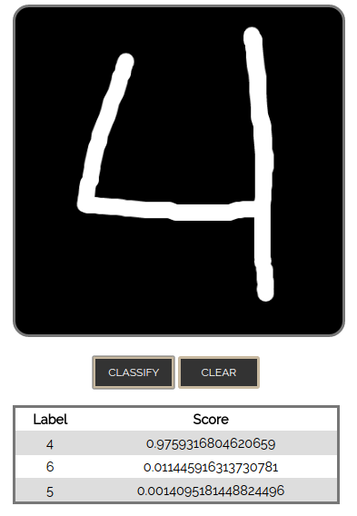
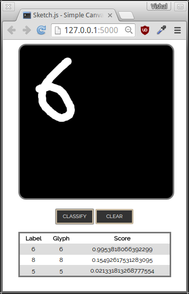
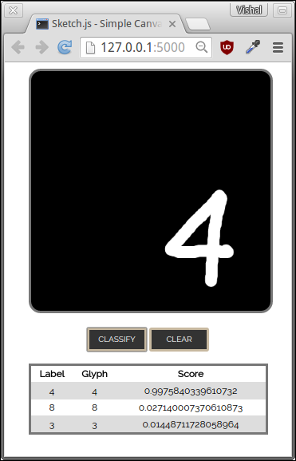

```
$ python generate_data.py data/fontdata_small.mat --num_fonts 200 --pixels 20

Generating font-based training data...
  [####################################]  100%
Successfully created training data!

$ python generate_data.py data/fontdata_full.mat --pixels 20

$ python visualize_data.py data/fontdata_small.mat

$ python train.py data/fontdata_small.mat data/fontweights_small.mat
...
Training Set Accuracy: 94.15

$ python predict.py data/fontdata_small_full.mat data/fontweights_small.mat
Loading saved Neural Network parameters ...
Test Set Accuracy: 91.17
```

```
$ python convert_data.py data/ex4data1.mat data/ex4data1_conv.mat --source matlab --target matlab

$ python train.py data/ex4data1_conv.mat weights/ex4weights_new.mat

$ python predict.py data/ex4data1_conv.mat weights/ex4weights_new.mat  
Loading saved Neural Network parameters ...
Test Set Accuracy: 98.28

$ python web.py
```

For matplotlib issues on Ubuntu, see [this guide](http://www.pyimagesearch.com/2015/08/24/resolved-matplotlib-figures-not-showing-up-or-displaying/)
to getting figures displaying correctly.






