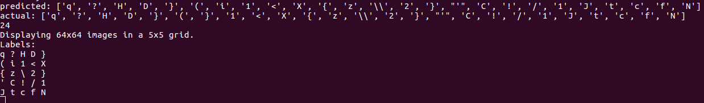

### Setup

```
$ pip install -r requirements.txt`
```

### Download Training Data

```
$ ./get_en_fonts.sh
$ python -m dataset preview_data --dataset en --font_limit 100
```

### Train

```
$ python -m models.train_en_vgg16
```

### Eval

```
$ python -m models.test_en_vgg16
```

### Web UI

```
$ python -m frontend.www
```

For matplotlib issues on Ubuntu, see [this guide](http://www.pyimagesearch.com/2015/08/24/resolved-matplotlib-figures-not-showing-up-or-displaying/)
to getting figures displaying correctly.

